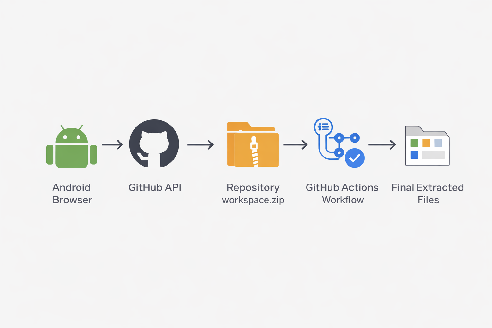
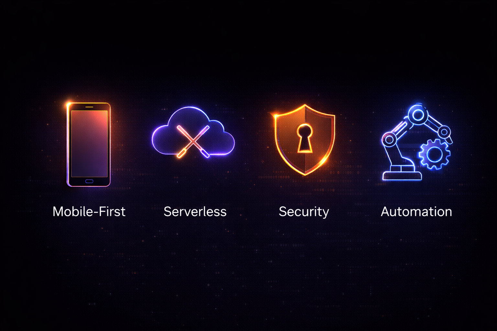

  

# DemonZ Deployer

**A serverless, zero-friction deployment engine engineered to synchronize mobile development workspaces directly to GitHub.**

---

## System Overview

Mobile development environments often generate thousands of individual files. Attempting to synchronize these local workspaces with remote version control via mobile web browsers introduces significant friction, payload limitations, and browser instability.

DemonZ Deployer resolves this bottleneck using a hybrid serverless architecture. Instead of uploading files individually, developers transmit a single compressed workspace binary (`workspace.zip`) via a secure, client-side interface. This action triggers an automated CI/CD pipeline that unpacks, verifies, and commits the structural changes directly to the target repository in the background.

  

## Repository Navigation & Access

DemonZ Deployer operates as a centralized, zero-installation tool. Access the core components and live application here:

* **[Live Web Interface](https://demonzdevelopment.github.io/DemonZ-Deployer/)**: The official client-side application. Use this portal to deploy your workspace payloads.
* **[Extraction Pipeline (.github/workflows/deployer-pipeline.yml)](./.github/workflows/deployer-pipeline.yml)**: The GitHub Actions workflow configuration required in your target repositories.
* **[Frontend Source Code (index.html)](./index.html)**: The raw HTML, CSS, and JavaScript powering the web application.

## Architectural Flow

This deployment sequence requires zero external backend infrastructure, operating entirely through the GitHub REST API and GitHub Actions runners.

1. **Client Authentication:** The static frontend authenticates with the GitHub API using a locally stored Personal Access Token (PAT).
2. **Payload Transmission:** The compressed workspace binary is streamed directly to the repository via a PUT request.
3. **Pipeline Execution:** The arrival of the payload triggers the automated extraction workflow on GitHub's servers.
4. **Structural Synchronization:** The runner unpacks the payload, purges the initial archive, and executes a clean structural commit to the active branch.

## Core Capabilities

* **Mobile-Optimized Interface:** A responsive frontend engineered specifically for constrained mobile displays and touch interfaces.
* **Zero-Server Infrastructure:** Operates without external databases, custom workers, or hosting fees.
* **Client-Side Cryptography:** Authentication tokens are stored exclusively in browser local storage and never traverse third-party servers.
* **Failsafe Automation:** The extraction pipeline includes payload integrity verification and bypasses execution if structural changes are identical to the current commit.

## Implementation Guide

Deploying your workspace is completely frictionless. You do not need to install applications or host this interface yourself. 

**1. Configure the Target Repository:**
* Navigate to the GitHub repository you intend to synchronize files with.
* Create the following directory path: `.github/workflows/`
* Copy the official **[deployer-pipeline.yml](https://github.com/DemonZDevelopment/DemonZ-Deployer/blob/main/.github/workflows/deployer-pipeline.yml)** from this repository into that folder.

**2. Execute the Deployment:**
* Open the official **[DemonZ Deployer Interface](https://demonzdevelopment.github.io/DemonZ-Deployer/)**.
* Input your target repository identifier (e.g., `DemonZDevelopment/my-app`) and your Personal Access Token.
* Upload your `workspace.zip` into the UI. The pipeline will automatically handle the extraction and synchronization.

## Access Token Generation

DemonZ Deployer requires a GitHub Personal Access Token (PAT) with repository write access to transmit payloads securely via the API. 

**Generating a Fine-Grained Token (Recommended for Security):**
1. Navigate to your GitHub profile settings.
2. Select **Developer settings** > **Personal access tokens** > **Fine-grained tokens**.
3. Click **Generate new token**.
4. Assign a strict naming convention (e.g., `DemonZ-Deployer-Access`) and set an expiration date.
5. Under **Repository access**, select **Only select repositories** and choose your specific target workspace.
6. Under **Repository permissions**, grant **Read and write** access to **Contents**.
7. Generate the token and store it securely.

**Generating a Classic Token:**
If utilizing a Classic Token instead of Fine-Grained, ensure the overarching `repo` scope is checked during generation.

## Troubleshooting & Diagnostics

If the deployment sequence fails, consult the terminal logs in the UI and reference the solutions below.

**HTTP 401 / Bad Credentials:**
The Personal Access Token provided is invalid, expired, or was copied incorrectly. Regenerate the token following the steps above and update your client-side credentials.

**HTTP 404 / Repository Not Found:**
The target repository format is incorrect, or your token lacks permission to view the repository. Ensure the target format is exactly `OwnerName/RepositoryName` (e.g., `DemonZDevelopment/my-app`) and verify your token scopes.

**Payload Transmitted but Pipeline Fails to Trigger:**
Ensure the `deployer-pipeline.yml` file is located exactly within the `.github/workflows/` directory on the default branch of your target repository. GitHub Actions will not monitor for the `workspace.zip` push event if the workflow file is misplaced.

**Workflow Fails During Commit Phase:**
If the GitHub Action successfully extracts the payload but fails to push the new commit, the repository's bot permissions are restricted. Navigate to the target repository **Settings** > **Actions** > **General** > **Workflow permissions**, and ensure **Read and write permissions** is actively selected.

## Security Notice

This application operates exclusively as a static, client-side interface. Personal Access Tokens provided to the application are utilized strictly for authorizing requests to the official GitHub API. DemonZ Development does not collect, proxy, transmit, or store user credentials or repository telemetry.

---

  <b>Engineered by DemonZ Development</b>

