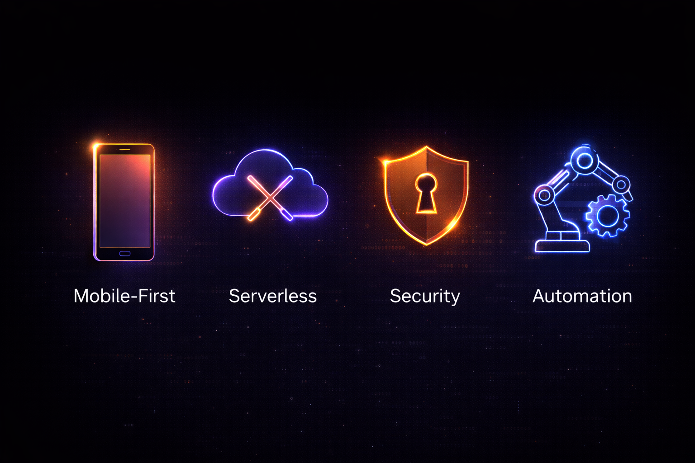

<div align="center">
  
</div>

<br/>

<div align="center">

# ⚡ DemonZ Deployer

**Push your entire mobile workspace to GitHub in seconds.**  
*No Git. No terminal. No backend. Just upload and go.*

[](#)
[](#)
[](https://demonzdevelopment.github.io/DemonZ-Deployer/)
[](https://demonzdevelopment.online)

<br/>

### [🚀 Open the App →](https://demonzdevelopment.github.io/DemonZ-Deployer/)

<br/>

*Engineered for developers building on Android. Works anywhere.*

</div>

---

<div align="center">
  
</div>

<br/>

## What is DemonZ Deployer?

If you've ever tried pushing a full project to GitHub from your phone — you know the pain. Mobile browsers crash. File pickers break. You end up uploading one file at a time, losing your mind.

**DemonZ Deployer fixes that.**

Zip your workspace. Drop it in. Done. Your entire project lands in GitHub, extracted and committed cleanly, as if you pushed it from a proper machine.

No installation. No accounts beyond GitHub. No cost. It runs entirely in your browser.

<br/>

<div align="center">
  
</div>

---

## How It Works

```
You zip your project  →  Drop it in the app  →  GitHub takes over
```

Behind the scenes:

1. You sign in with your GitHub account — no passwords, no copy-pasting tokens
2. You pick which of your repositories to deploy to
3. You drop your `workspace.zip` into the app
4. The app uploads it directly to GitHub
5. GitHub automatically unzips it, commits the files, and cleans up

That's it. Your project is live in the repo, history intact, ready to clone or share.

---

## What's New in v2.0

v2.0 is a full rebuild. Everything that was frustrating about v1 is gone.

<div align="center">

| | v1 | v2 |
|:---|:---:|:---:|
| Sign in | Paste a token manually | One-click GitHub login |
| Pick a repo | Type it by hand | Search your actual repos |
| Pick a branch | Always `main` | Choose any branch |
| Create a repo | ❌ | ✅ Right from the app |
| Workflow setup | Copy a file yourself | One button — done |
| Error messages | `HTTP 422` | Plain English explanations |
| Security | Token stored forever | Cleared when you close the tab |

</div>

---

## Getting Started

### 1. Open the app

Head to **[demonzdevelopment.github.io/DemonZ-Deployer](https://demonzdevelopment.github.io/DemonZ-Deployer/)**

### 2. Sign in with GitHub

Click **Connect with GitHub**. A short code appears — open GitHub, enter the code, hit Authorize. The app logs you in automatically. No passwords. No tokens to manage.

### 3. Pick a repository

Your repos load automatically. Search by name or create a new one directly from the app.

### 4. Set up the repository (first time only)

If this is a new repo, click **Setup Repository**. This installs the deployment pipeline into your repo in one click — no manual file copying needed.

### 5. Drop your zip and deploy

Drag your `workspace.zip` into the dropzone, pick your branch, hit **Deploy Workspace**. Watch the pipeline run in real-time. When it's done, you'll see a direct link to the commit.

---

## Security

Your account never leaves your browser.

- Sign-in uses **GitHub Device Flow** — the same method GitHub's own CLI uses. No passwords are typed into this app.
- Your access token is stored in **sessionStorage** — it's automatically deleted the moment you close the browser tab.
- No data is ever sent to DemonZ Development's servers. The app talks directly to GitHub's API.
- The app is open source. You can read every line of code before using it.

---

## Tips

**Keep your zip small.** GitHub has a ~50 MB limit on files uploaded through the browser API. Leave out `node_modules/`, build folders, and anything auto-generated. Your actual source code is usually well under this.

**Use a fine-grained token if you're cautious.** Device Flow asks for `repo` scope by default. If you'd prefer tighter control, you can revoke the app's access anytime from your GitHub Settings → Applications.

**The pipeline only runs when `workspace.zip` is pushed.** It won't trigger on any of your other commits. It extracts the zip, deletes it, and commits your files cleanly.

---

## Frequently Asked Questions

**Do I need to install anything?**  
Nothing. Open the link, sign in, deploy.

**Does it work on iPhone?**  
Yes. The app is fully responsive. It was primarily built and tested on Android, but works on any modern mobile browser.

**Will my other files in the repo get deleted?**  
No. The pipeline extracts your zip on top of what's already there. Files not included in the zip are left untouched.

**What if I deploy the same zip twice?**  
If nothing changed, the pipeline detects this and skips the commit. No empty commits, no noise in your history.

**Can I use this for any repo, even ones I didn't create?**  
As long as your GitHub account has write access to the repo and the deployment pipeline is installed, yes.

**Is this free?**  
Completely. The app runs on GitHub Pages (free). The backend pipeline runs on GitHub Actions (free for public repos, and has a generous free tier for private repos).

---

## Built by DemonZ Development

DemonZ Deployer started as a personal solution — a way to push a full Termux workspace to GitHub without fighting the mobile browser. It grew into something worth sharing.

If it saves you time, a ⭐ on the repo goes a long way.

- 🌐 [demonzdevelopment.online](https://demonzdevelopment.online)
- 💻 [github.com/DemonZDevelopment](https://github.com/DemonZDevelopment)
- 📝 [Dev.to writeup — how it all started](https://dev.to/cyrus_bye_ce1068ae57ce65b/how-to-sync-mobile-workspaces-directly-to-github-without-a-backend-3jbb)

---

<div align="center">

**⚡ DemonZ Deployer** — MIT License

*Forging Digital Empires*

</div>

<div align="center">

# DemonZ Deployer

### v2.0 — OAuth Edition

**A serverless, zero-friction deployment engine engineered to synchronize mobile development workspaces directly to GitHub.**  
*Built for Android developers. Forged under DemonZ Development.*

[](#)
[](#)
[](#)
[](#)
[](https://demonzdevelopment.online)
[](https://demonzdevelopment.github.io/DemonZ-Deployer/)

</div>

---

## Table of Contents

- [Overview](#overview)
- [What's New in v2.0](#whats-new-in-v20)
- [Architecture](#architecture)
- [Project Structure](#project-structure)
- [Quick Start](#quick-start)
  - [Step 1 — Create a GitHub OAuth App](#step-1--create-a-github-oauth-app)
  - [Step 2 — Deploy the Cloudflare Worker](#step-2--deploy-the-cloudflare-worker)
  - [Step 3 — Configure the App](#step-3--configure-the-app)
  - [Step 4 — Deploy to GitHub Pages](#step-4--deploy-to-github-pages)
- [Using the App](#using-the-app)
- [The Workflow Pipeline](#the-workflow-pipeline)
- [Security Model](#security-model)
- [Worker Rate Limiting (Optional KV Setup)](#worker-rate-limiting-optional-kv-setup)
- [Troubleshooting](#troubleshooting)
- [FAQ](#faq)
- [Contributing](#contributing)
- [Changelog](#changelog)
- [License](#license)

---

## Overview

If you have ever tried doing serious development work on a mobile device — building web apps, running Python scripts in Termux, or managing a project entirely from Android — you know the absolute nightmare that is version control on the go.

Writing the code is the easy part. Trying to push hundreds of files, nested folders, and assets to a GitHub repository via a mobile web browser? Crashes. Payload limits. Immense frustration.

**DemonZ Deployer was built to solve this.**

Instead of pushing files individually, you compress your entire workspace into a single `workspace.zip` file. DemonZ Deployer uploads that binary directly to your GitHub repository via the REST API, where a lightweight GitHub Actions pipeline automatically extracts, verifies, and commits the structural changes in the background.

No custom backends. No databases. No hosting fees. No Git CLI required.

<div align="center">
  
</div>

---

## What's New in v2.0

v2.0 is a ground-up rebuild. Every major pain point from v1 has been addressed.

| Feature | v1.0 | v2.0 |
|---|---|---|
| **Authentication** | Manual PAT paste | GitHub Device Flow OAuth — no copy-paste |
| **Token Storage** | `localStorage` (persists forever) | `sessionStorage` (auto-cleared on tab close) |
| **Repository Selection** | Free-text input (error-prone) | Live searchable dropdown from your actual repos |
| **Branch Selection** | Hardcoded `main` | Live branch list from selected repo |
| **Create Repository** | ❌ Not possible | ✅ Create repos directly from the UI |
| **Workflow Setup** | Manual GitHub UI copy-paste | One-click "Setup Repository" — installs pipeline automatically |
| **Workflow Source** | Hardcoded string (could go stale) | Fetched live from the Deployer repo (always latest) |
| **Error Messages** | Raw HTTP codes (`HTTP 422`) | Human-readable descriptions with fix guidance |
| **File Size Warning** | ❌ | ✅ Warns if artifact exceeds GitHub's ~50 MB API limit |
| **Copy Logs** | ❌ | ✅ One-click copy all terminal output |
| **Commit Links** | Terminal text only | Clickable → GitHub commit & Actions links |
| **Codebase** | Single 1200-line `index.html` | 9 focused modules across `css/`, `js/`, `worker/` |
| **Worker Security** | `Access-Control-Allow-Origin: *` | Origin whitelist + rate limiting + body size cap |

---

## Architecture

DemonZ Deployer operates on a hybrid serverless architecture. There is zero custom backend infrastructure.

```
┌─────────────────────────────────────────────────────┐
│                   BROWSER (Client)                  │
│                                                     │
│  index.html + css/ + js/                            │
│  ┌─────────────┐  ┌──────────────┐  ┌────────────┐ │
│  │  auth.js    │  │   deploy.js  │  │   app.js   │ │
│  │ Device Flow │  │ Base64 + PUT │  │ Controller │ │
│  └──────┬──────┘  └──────┬───────┘  └────────────┘ │
└─────────│────────────────│───────────────────────────┘
          │                │
          ▼                ▼
┌──────────────┐   ┌───────────────────────────────────┐
│  Cloudflare  │   │          api.github.com            │
│   Worker     │   │                                   │
│  (CORS proxy │   │  GET  /user                       │
│  for OAuth   │   │  GET  /user/repos                 │
│  endpoints   │   │  GET  /repos/{r}/branches         │
│  only)       │   │  GET  /repos/{r}/contents/{path}  │
└──────┬───────┘   │  PUT  /repos/{r}/contents/{path}  │
       │           │  POST /user/repos                 │
       ▼           └──────────────────┬────────────────┘
github.com/                           │
login/device/code                     │ workspace.zip pushed
login/oauth/                          ▼
access_token           ┌──────────────────────────────┐
                       │   GitHub Actions Runner       │
                       │                               │
                       │  1. Checkout repo             │
                       │  2. Verify payload exists     │
                       │  3. unzip -o workspace.zip    │
                       │  4. rm workspace.zip          │
                       │  5. git add -A && git commit  │
                       │  6. git push                  │
                       └──────────────────────────────┘
```

**Why the Cloudflare Worker?**

GitHub's OAuth token endpoints (`/login/device/code` and `/login/oauth/access_token`) do not include CORS headers, so browsers cannot call them directly. The Worker is a minimal transparent proxy — its only job is to forward these two requests and attach `Access-Control-Allow-Origin`. It stores nothing, logs nothing, and only accepts requests from your whitelisted origin.

---

## Project Structure

```
DemonZ-Deployer/
├── index.html                        # Entry point — login view + app view
├── css/
│   └── style.css                     # All styles, variables, responsive layout
├── js/
│   ├── config.js                     # ⚠ YOUR CONFIG — CLIENT_ID + PROXY_URL
│   ├── api.js                        # GitHub REST API wrapper (all requests here)
│   ├── auth.js                       # Device Flow login, session management
│   ├── terminal.js                   # Terminal UI component
│   ├── pipeline.js                   # Step visualizer (Auth→Encode→SHA→Upload→Done)
│   ├── deploy.js                     # Deployment orchestration + workflow installer
│   └── app.js                        # Main controller — ties all modules together
├── worker/
│   └── worker.js                     # Cloudflare Worker (CORS proxy, hardened)
├── .github/
│   └── workflows/
│       └── deployer-pipeline.yml     # GitHub Actions — lives in THIS repo
│                                     # auto-installed into TARGET repos on demand
└── assets/
    ├── banner.png
    ├── deployer.jpg
    ├── architecture.png
    └── features.png
```

---

## Quick Start

### Prerequisites

- A GitHub account
- A free [Cloudflare account](https://workers.cloudflare.com) (for the Worker)
- A GitHub repository to host the app (for GitHub Pages)

---

### Step 1 — Create a GitHub OAuth App

This is what allows users to sign in via Device Flow. It takes about 2 minutes.

1. Go to **GitHub → Settings → Developer Settings → OAuth Apps → New OAuth App**
2. Fill in the fields:

   | Field | Value |
   |---|---|
   | **Application name** | `DemonZ Deployer` |
   | **Homepage URL** | `https://YOUR-USERNAME.github.io/DemonZ-Deployer/` |
   | **Authorization callback URL** | `https://YOUR-USERNAME.github.io/DemonZ-Deployer/` (Device Flow doesn't use it, but GitHub requires it) |

3. Click **Register application**
4. On the next screen, copy your **Client ID** — this is a public identifier, safe to commit

> ⚠ **Do NOT generate or copy a Client Secret.** Device Flow authentication does not use one. Never put a client secret in a static site.

---

### Step 2 — Deploy the Cloudflare Worker

The Worker handles the CORS proxy for GitHub's OAuth endpoints.

1. Sign up at [workers.cloudflare.com](https://workers.cloudflare.com) — the free tier is more than sufficient
2. Click **Create a Worker**
3. In the editor, delete all existing code and paste the contents of `worker/worker.js`
4. **Before saving**, find the `ALLOWED_ORIGINS` array near the top of the file and update it:

   ```js
   const ALLOWED_ORIGINS = [
     'https://YOUR-USERNAME.github.io',
     'http://localhost',       // keep for local dev
     'http://127.0.0.1',      // keep for local dev
   ];
   ```

5. Click **Save and Deploy**
6. Copy the Worker URL — it will look like `https://demonz-deployer.YOUR-SUBDOMAIN.workers.dev`

---

### Step 3 — Configure the App

Open `js/config.js` and fill in your two values:

```js
const CONFIG = Object.freeze({
  CLIENT_ID:  'YOUR_GITHUB_OAUTH_APP_CLIENT_ID',   // from Step 1
  PROXY_URL:  'https://your-worker.workers.dev',   // from Step 2

  // Do not change these:
  DEPLOYER_REPO: 'DemonZDevelopment/DemonZ-Deployer',
  WORKFLOW_PATH: '.github/workflows/deployer-pipeline.yml',
  SCOPES:        'repo',
  POLL_INTERVAL: 5,
});
```

> `CLIENT_ID` is intentionally public — it is safe to commit to your public repository. See the [Security Model](#security-model) section for a full explanation.

---

### Step 4 — Deploy to GitHub Pages

1. Push the project to a GitHub repository
2. Go to **Repository Settings → Pages**
3. Set **Source** to `Deploy from a branch`, select `main`, folder `/` (root)
4. Click **Save** — your app will be live at `https://YOUR-USERNAME.github.io/DemonZ-Deployer/` within a minute

> If you are hosting this under a different repo name, update your OAuth App's Homepage URL and the `ALLOWED_ORIGINS` in the Worker to match.

---

## Using the App

### Sign In

When you first open the app, you will see the login screen. Click **Connect with GitHub**. A device code (e.g. `ABCD-1234`) will appear. Click **Open GitHub to Authorize**, enter the code on GitHub's page, and approve the request. The app polls automatically and logs you in once approved.

Your access token is stored in `sessionStorage` — it is automatically cleared when you close the browser tab.

### Select or Create a Repository

After signing in, your repositories load automatically into a searchable dropdown. You can:

- **Search** for an existing repo by name
- **Select** any repo to load its branches
- **Create a new repo** using the `+ New Repo` button — set a name, optional description, and public/private visibility

### Set Up the Target Repository

After selecting a repo, the **workflow badge** shows whether the deployment pipeline is already installed. If it shows a warning icon, click **Setup Repository** — this fetches the latest `deployer-pipeline.yml` from the DemonZ Deployer repo and commits it directly to your target repo's `.github/workflows/` directory. No manual file copying required.

### Deploy

1. Drag and drop (or click to browse) your `workspace.zip` into the dropzone
2. Select the target branch from the dropdown
3. Click **Deploy Workspace**

The pipeline tracker shows live progress across five stages: Auth → Encode → SHA Check → Upload → Deployed. When complete, clickable commit and Actions links appear in the terminal.

---

## The Workflow Pipeline

The `deployer-pipeline.yml` in this repository serves a dual purpose:

1. **It lives here** — in the DemonZ-Deployer repo — as the canonical source of truth
2. **It gets installed into target repos** — the app fetches it live via the GitHub API and commits it, ensuring target repos always receive the latest version

The pipeline triggers on any push that includes `workspace.zip`:

```yaml
on:
  push:
    paths:
      - 'workspace.zip'
```

On trigger, the runner:
- Checks out the repository
- Verifies the payload file exists
- Extracts `workspace.zip` into the repository root
- Deletes the zip archive
- Detects whether any files actually changed
- If changes exist, commits and pushes them with the bot identity

**Workflow permissions required in target repos:**  
Navigate to **Repository Settings → Actions → General → Workflow permissions** and ensure **Read and write permissions** is selected. Without this, the pipeline's commit step will fail with a 403.

---

## Security Model

### Why `CLIENT_ID` is safe in a public repository

The OAuth Client ID is a **public identifier** — it identifies your application to GitHub, but grants no access on its own. GitHub's Device Flow was specifically designed for public clients (CLIs, mobile apps, static sites) that cannot securely store a secret. GitHub's own CLI tool ships its `client_id` in open source code for the same reason.

Anyone who obtains your `CLIENT_ID` can only use it to request authorization **from their own GitHub account** on your app — they cannot impersonate your app, access your data, or do anything without explicit user approval on GitHub's own UI.

**Never generate a Client Secret for this project.** Device Flow does not require one, and putting it in a static site would be a genuine security risk.

### Token lifecycle

| Where | What | How long |
|---|---|---|
| `sessionStorage` | GitHub OAuth access token | Until the browser tab is closed |
| Cloudflare Worker | Nothing | Not stored at all |
| GitHub API calls | Token in `Authorization` header | Only during the active request |

### Worker security layers

The Cloudflare Worker (`worker/worker.js`) implements the following protections:

- **Origin whitelist** — only requests from your configured `ALLOWED_ORIGINS` are processed; all others return `403 Forbidden`
- **Path allowlist** — only `/device/code` and `/token` are proxied; all other paths return `404`
- **Method guard** — only `POST` and `OPTIONS` (preflight) are accepted
- **Body size cap** — requests larger than 1 KB are rejected with `413`; GitHub OAuth payloads are never larger than ~200 bytes
- **JSON validation** — the body must be valid JSON before it is forwarded
- **IP rate limiting** — `/device/code` is capped at 5 requests per IP per 5 minutes; `/token` at 30 per 5 minutes (to accommodate polling)
- **`Vary: Origin` header** — prevents CDN caches from serving one user's response to another

---

## Worker Rate Limiting (Optional KV Setup)

By default the Worker uses in-memory rate limiting, which resets per Worker isolate. For persistent, cross-instance rate limiting (recommended for production), bind a Cloudflare KV namespace:

1. In the Cloudflare dashboard, go to **Workers & Pages → KV**
2. Click **Create a namespace**, name it `RATE_LIMIT`
3. Go to your Worker → **Settings → Variables → KV Namespace Bindings**
4. Click **Add binding**, set the variable name to `RATE_LIMIT`, select your namespace
5. Save and redeploy

Once bound, the Worker automatically switches to KV-backed rate limiting with no code changes needed.

---

## Troubleshooting

### Login Issues

**"Proxy error — check your PROXY_URL in config.js"**  
Your `PROXY_URL` in `js/config.js` is missing, incorrect, or the Worker is not deployed. Double-check the URL matches exactly what Cloudflare assigned.

**"Authorization was denied on GitHub"**  
You clicked **Deny** instead of **Authorize** on GitHub's device activation page. Click **Connect with GitHub** again to start a new session.

**"The code expired. Please try again."**  
Device codes expire after 15 minutes. Click **Connect with GitHub** again to generate a fresh code.

**The device code appears but GitHub says it's invalid**  
Ensure you are entering the code at `https://github.com/login/device` exactly — not the general GitHub login page.

---

### Deployment Issues

**HTTP 401 — Bad credentials**  
Your session token is invalid or has been revoked. Sign out and sign back in.

**HTTP 403 — Forbidden**  
Your token lacks `repo` write scope. This is unusual for Device Flow. Sign out, sign in again, and ensure you approve the correct permissions on GitHub's authorization screen.

**HTTP 404 — Repository not found**  
The selected repository is private and your token may have insufficient scope, or the repo was deleted. Refresh the page to reload the repository list.

**HTTP 422 — Unprocessable Entity**  
GitHub rejected the payload, most commonly because the file exceeds the GitHub Contents API limit (~50 MB). Reduce the size of your workspace before zipping, or use Git LFS for large binary assets.

**Payload uploaded but Actions pipeline never triggers**  
- Verify `deployer-pipeline.yml` is in `.github/workflows/` on the **default branch** of the target repository
- Check **Repository Settings → Actions → General → Workflow permissions** is set to **Read and write permissions**
- Confirm Actions are not disabled globally on the repository

**Pipeline triggers but fails at the commit step**  
Same permissions issue as above — set **Read and write permissions** under Workflow permissions.

**CORS error in browser console from the Worker**  
Your GitHub Pages URL does not match the `ALLOWED_ORIGINS` list in `worker/worker.js`. Update the list and redeploy the Worker.

---

## FAQ

**Do I need to install Git or any CLI tools?**  
No. The entire deployment is browser-based.

**Does this work on iOS?**  
Yes, though DemonZ Deployer was primarily designed and tested for Android. The interface is fully responsive and touch-optimized.

**Is my GitHub token ever sent to DemonZ Development's servers?**  
No. The Cloudflare Worker only proxies GitHub's OAuth device flow endpoints — it never sees your access token. All GitHub API calls (listing repos, uploading files) are made directly from your browser to `api.github.com` with your token.

**Can I use this with GitHub Enterprise?**  
Not currently. The app targets `api.github.com` and `github.com` OAuth endpoints. Enterprise support would require configuring custom base URLs.

**What is the maximum workspace size I can deploy?**  
GitHub's Contents API enforces a hard limit of 100 MB per file, with a practical soft limit of around 50 MB before responses become unreliable. For larger workspaces, consider excluding `node_modules`, build artifacts, and other auto-generated content from your zip before deploying.

**Can multiple people use the same deployed instance?**  
Yes. Each user authenticates with their own GitHub account via Device Flow and operates entirely within their own token scope.

**What happens if two people deploy to the same repo at the same time?**  
The second deploy's SHA check will catch the state updated by the first and correctly overwrite the file. The GitHub Actions runner processes pushes sequentially, so there is no race condition in the extraction step.

---

## Contributing

DemonZ Development actively welcomes community contributions.

**Before opening a pull request:**

1. Review [CONTRIBUTING.md](./CONTRIBUTING.md) for code standards and commit message conventions
2. Open an issue first for any non-trivial change so the approach can be agreed upon
3. Keep PRs focused — one logical change per PR

**Bug reports:**  
Use the [Bug Report template](.github/ISSUE_TEMPLATE/bug_report.md). Include the exact error text from the terminal UI, your browser and OS, and steps to reproduce.

**Feature requests:**  
Use the [Feature Request template](.github/ISSUE_TEMPLATE/feature_request.md). Describe the problem you are solving, not just the solution you have in mind.

---

## Changelog

### v2.0.0 — March 2026

**Breaking changes:**
- `js/config.js` requires `CLIENT_ID` and `PROXY_URL` — the app will not function without these
- `localStorage`-based credential storage removed; credentials now use `sessionStorage`
- Single `index.html` architecture replaced with multi-file module structure

**New features:**
- GitHub Device Flow OAuth — no PAT copy-paste required
- Live repository list with search and filtering
- Live branch selector populated from target repository
- Create new repositories directly from the UI
- One-click workflow installation — fetched live from the Deployer repo
- Workflow status badge per selected repo/branch
- Human-readable error messages with resolution guidance
- File size pre-flight warning (>50 MB)
- Copy-all terminal logs button
- Clickable commit and GitHub Actions links after successful deploy
- Hardened Cloudflare Worker with origin whitelist, rate limiting, body size cap, and JSON validation

**Improvements:**
- Token stored in `sessionStorage` instead of `localStorage`
- Codebase split into 9 focused modules (`api.js`, `auth.js`, `terminal.js`, `pipeline.js`, `deploy.js`, `app.js`)
- Responsive layout improvements for narrow mobile viewports

---

### v1.0.0 — February 2026

Initial release. Single-file serverless deployer using GitHub Personal Access Tokens stored in `localStorage`. Manual PAT entry, free-text repository input, static workflow file embedded in source. Featured real-time terminal UI, pipeline step visualizer, and Base64 PUT upload to GitHub Contents API. Published alongside a [Dev.to writeup](https://dev.to/cyrus_bye_ce1068ae57ce65b/how-to-sync-mobile-workspaces-directly-to-github-without-a-backend-3jbb) covering the architecture and mobile development use case.

---

## License

MIT License — see [LICENSE](./LICENSE) for full terms.

---

<div align="center">

**Engineered by [DemonZ Development](https://demonzdevelopment.online)**  
*Forging Digital Empires*

</div>
